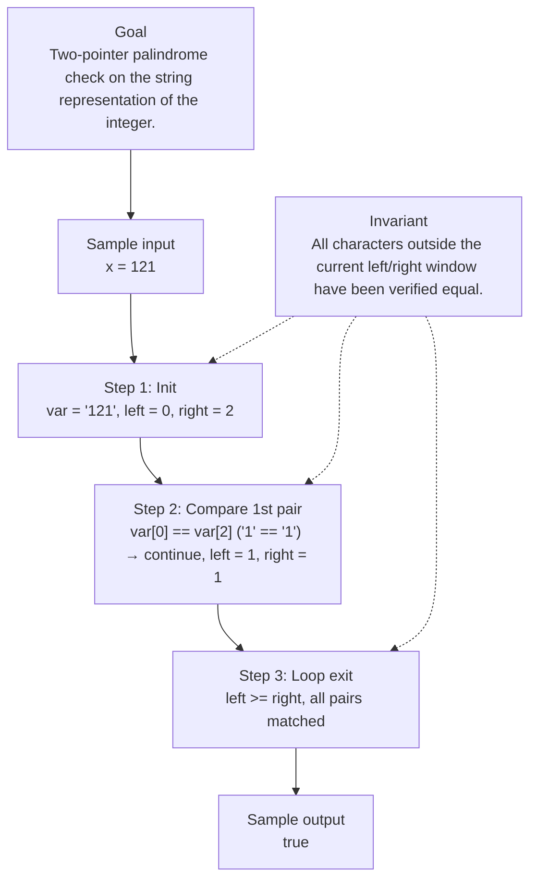

# 9. Palindrome Number

[View problem on LeetCode](https://leetcode.com/problems/palindrome-number/submissions/2122520138/)

## Solution metadata

- **Difficulty:** Easy
- **Language:** Python3
- **Topics:** Math
- **Solved:** 2026-08-28 04:21 UTC
- **Runtime:** 0 ms
- **Memory:** —
- **Solution:** [Python3](./python/solution.py)

## Problem description

> Problem details captured from [LeetCode](https://leetcode.com/problems/palindrome-number/submissions/2122520138/).

Given an integer x, return true if x is a palindrome, and false otherwise.

## Examples

### Example 1

```text
Input:
x = 121

Output:
true
```

**Explanation:** 121 reads as 121 from left to right and from right to left.

### Example 2

```text
Input:
x = -121

Output:
false
```

**Explanation:** From left to right, it reads -121. From right to left, it becomes 121-. Therefore it is not a palindrome.

### Example 3

```text
Input:
x = 10

Output:
false
```

**Explanation:** Reads 01 from right to left. Therefore it is not a palindrome.

## Constraints

- `231 <= x <= 231 - 1`

## Follow-up

Could you solve it without converting the integer to a string?

## Interview overview

> Generated from the submitted solution and the official problem details above. Verify AI analysis before relying on it.

The core insight is that a palindrome reads the same forward and backward, so by comparing mirrored characters of the decimal representation we can decide correctness. Converting the integer to a string gives direct indexed access, enabling a two‑pointer scan from both ends until they meet.

### Solution replay



### Approach

1. Convert the integer x to its decimal string representation.
2. Initialize two indices: left at 0 and right at length‑1.
3. While left < right, compare characters at these positions.
4. If any pair differs, return false immediately.
5. Advance left and decrement right; if the loop finishes, all pairs matched, so return true.

### Complexity

- **Time:** O(n) where n is the number of digits in x
- **Space:** O(n) for the string representation

### Complexity self-check

- **Verdict:** optimal
- **Intended:** O(n) time, O(n) extra space
- For the string‑based approach this is optimal; a follow‑up can achieve O(1) space by reversing half of the number.

### Edge cases

- x = 0 → true (single digit)
- x = -121 → false (negative numbers cannot be palindromes)
- x = 10 → false (trailing zero breaks symmetry)
- x = 1221 → true (even length palindrome)

_AI-generated with Groq; verify the analysis before relying on it._

## Study guide

Before reopening the solution:

1. Identify why **Math** fits the problem constraints.
2. State the invariant that makes the algorithm correct.
3. Replay the first example without looking at the implementation.
4. Derive the time and space complexity from the implementation.
5. Name an edge case that would break a weaker approach.

---
_Synced by [LeetRepo](https://github.com/)_