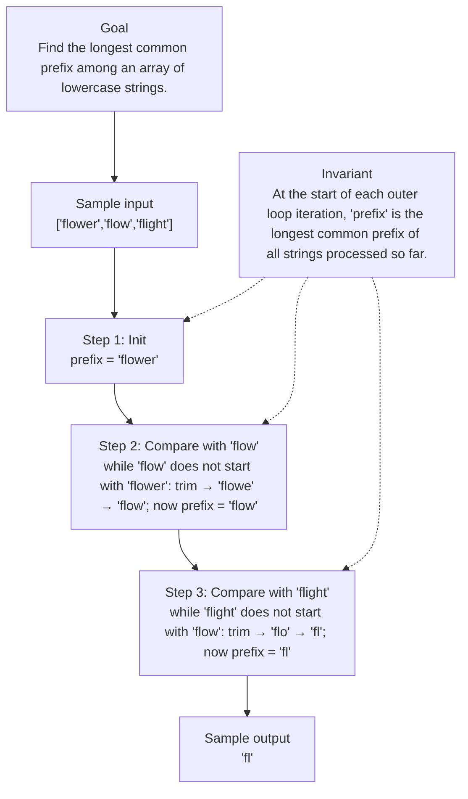

# 14. Longest Common Prefix

[View problem on LeetCode](https://leetcode.com/problems/longest-common-prefix/submissions/2122559416/)

## Solution metadata

- **Difficulty:** Easy
- **Language:** C++
- **Topics:** Array, String, Trie
- **Solved:** 2026-08-28 05:17 UTC
- **Runtime:** 0 ms
- **Memory:** —
- **Solution:** [C++](./cpp/solution.cpp)

## Problem description

> Problem details captured from [LeetCode](https://leetcode.com/problems/longest-common-prefix/submissions/2122559416/).

Write a function to find the longest common prefix string amongst an array of strings.
If there is no common prefix, return an empty string "".

## Examples

### Example 1

```text
Input:
strs = ["flower","flow","flight"]

Output:
"fl"
```

### Example 2

```text
Input:
strs = ["dog","racecar","car"]

Output:
""
```

**Explanation:** There is no common prefix among the input strings.

## Constraints

- `1 <= strs.length <= 200`
- `0 <= strs[i].length <= 200`
- strs[i] consists of only lowercase English letters if it is non-empty.

## Interview overview

> Generated from the submitted solution and the official problem details above. Verify AI analysis before relying on it.

The algorithm keeps a candidate prefix (initially the first string) and iteratively trims it until it becomes a prefix of each subsequent string. Because each trim removes one character, the total work is bounded by the length of the first string, guaranteeing the longest common prefix is found.

### Solution replay



### Approach

1. If the input array is empty, return an empty string.
2. Initialize `prefix` with the first string in the array.
3. For each remaining string `s`:
4. While `s` does not start with `prefix` (i.e., `s.find(prefix) != 0`), remove the last character from `prefix`.
5. If `prefix` becomes empty, return an empty string immediately.
6. After processing all strings, return `prefix`.

### Complexity

- **Time:** O(N * L) where N is the number of strings and L is the length of the shortest string (worst‑case the length of the first string). Each character of the initial prefix can be removed at most once.
- **Space:** O(1) extra space (ignoring the input and output strings).

### Complexity self-check

- **Verdict:** optimal
- **Intended:** The solution runs in linear time relative to the total number of characters examined, which matches the best possible bound for this problem.
- Any algorithm must inspect each character of the common prefix at least once, so O(N·L) is optimal.

### Edge cases

- Empty input array → ""
- Array with a single empty string → ""
- No common prefix, e.g., ["dog","cat","bird"] → ""
- All strings identical, e.g., ["same","same"] → "same"

_AI-generated with Groq; verify the analysis before relying on it._

## Study guide

Before reopening the solution:

1. Identify why **Trie** fits the problem constraints.
2. State the invariant that makes the algorithm correct.
3. Replay the first example without looking at the implementation.
4. Derive the time and space complexity from the implementation.
5. Name an edge case that would break a weaker approach.

---
_Synced by [LeetRepo](https://github.com/)_