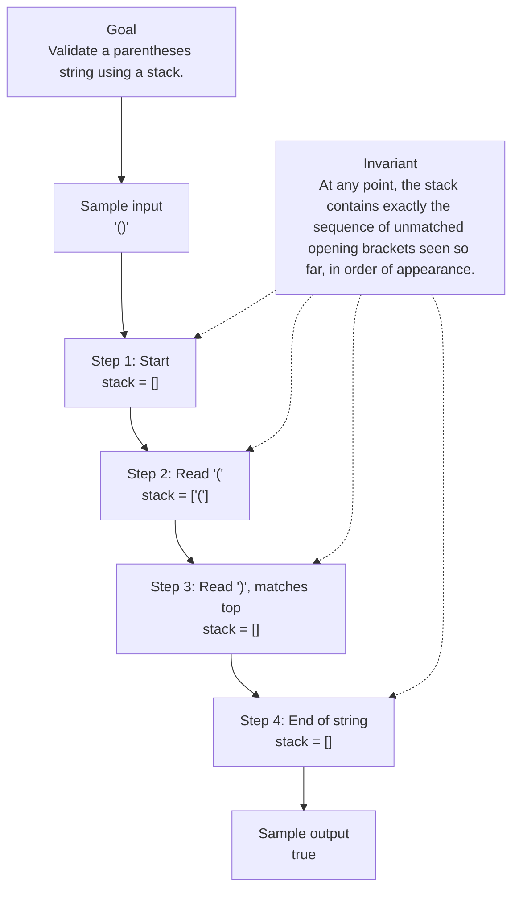

# 20. Valid Parentheses

[View problem on LeetCode](https://leetcode.com/problems/valid-parentheses/submissions/2136881883/)

## Solution metadata

- **Difficulty:** Easy
- **Language:** Python3
- **Topics:** String, Stack, Bracket Sequences
- **Solved:** 2026-09-09 22:26 UTC
- **Runtime:** 0 ms
- **Memory:** —
- **Solution:** [Python3](./python/solution.py)

## Problem description

> Problem details captured from [LeetCode](https://leetcode.com/problems/valid-parentheses/submissions/2136881883/).

Given a string s containing just the characters '(', ')', '{', '}', '[' and ']', determine if the input string is valid.
An input string is valid if:
Open brackets must be closed by the same type of brackets.
Open brackets must be closed in the correct order.
Every close bracket has a corresponding open bracket of the same type.

## Examples

### Example 1

```text
Input:
s = "()"

Output:
true
```

### Example 2

```text
Input:
s = "()[]{}"

Output:
true
```

### Example 3

```text
Input:
s = "(]"

Output:
false
```

### Example 4

```text
Input:
s = "([])"

Output:
true
```

## Constraints

- `1 <= s.length <= 104`
- s consists of parentheses only '()[]{}'.

## Interview overview

> Generated from the submitted solution and the official problem details above. Verify AI analysis before relying on it.

The solution uses a stack to enforce the LIFO order of brackets. By pushing opening brackets and ensuring each closing bracket matches the top of the stack, it guarantees both correct pairing and ordering, yielding a valid string only when the stack is empty at the end.

### Solution replay



### Approach

1. Create an empty list to serve as a stack.
2. Define a mapping from closing to opening brackets: {')':'(', '}':'{', ']':'['}.
3. Iterate over each character in the string:
4. If the character is an opening bracket, push it onto the stack.
5. If it is a closing bracket, check that the stack is non‑empty and that its top equals the mapped opening bracket; otherwise return false, then pop the top.
6. After the loop, return true only if the stack is empty.

### Complexity

- **Time:** O(n) where n is the length of the string, because each character is processed once.
- **Space:** O(n) in the worst case (e.g., all opening brackets) for the stack.

### Complexity self-check

- **Verdict:** optimal
- **Intended:** The algorithm achieves linear time and linear auxiliary space, which matches the lower bound for scanning the input.
- No faster solution exists without examining each character; any improvement would require reducing space, which is impossible for nested structures.

### Edge cases

- s = "" (empty string) – returns true because there are no unmatched brackets.
- s = "([)]" – returns false due to incorrect ordering.
- s = "((" – returns false because there are unmatched opening brackets.

_AI-generated with Groq; verify the analysis before relying on it._

## Study guide

Before reopening the solution:

1. Identify why **Stack** fits the problem constraints.
2. State the invariant that makes the algorithm correct.
3. Replay the first example without looking at the implementation.
4. Derive the time and space complexity from the implementation.
5. Name an edge case that would break a weaker approach.

---
_Synced by [LeetRepo](https://github.com/)_