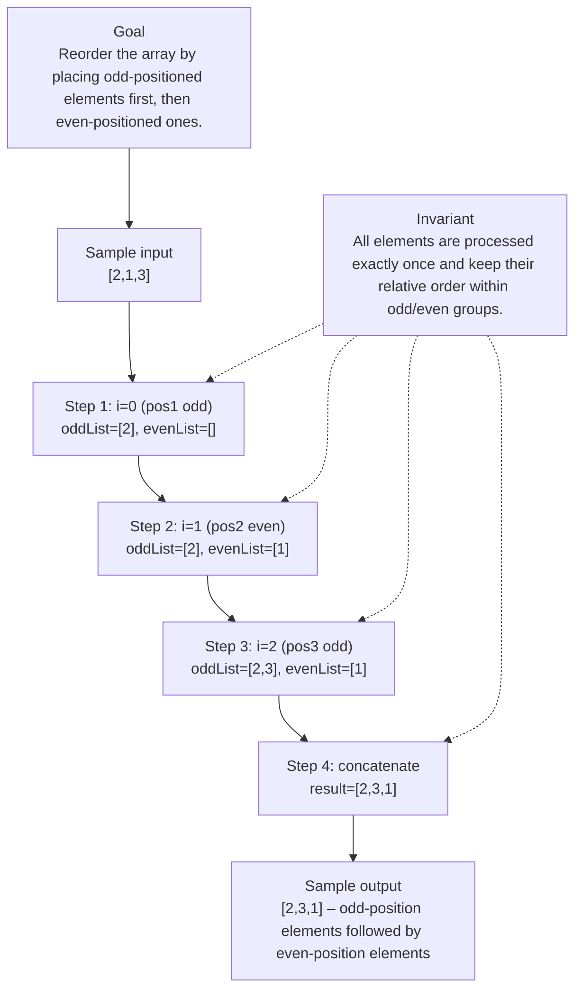

# 3069. Distribute Elements Into Two Arrays I

[View problem on LeetCode](https://leetcode.com/problems/distribute-elements-into-two-arrays-i/submissions/2114469584/)

- **Difficulty:** Easy
- **Language:** Java
- **Topics:** Array, Simulation
- **Solved:** 2026-08-20 21:53 UTC
- **Runtime:** —
- **Memory:** —

## Problem description

You are given a 1-indexed array of distinct integers nums of length n.

## Interview overview

Collect elements at odd indices (1‑based) into one list, then elements at even indices into another, and concatenate them. The result preserves the relative order within each parity group.

### Solution replay

### Approach

1. Create two dynamic lists: oddList and evenList.
2. Iterate over nums with index i from 0 to n‑1 (1‑based position = i+1).
3. If (i+1) is odd, append nums[i] to oddList; else append to evenList.
4. Allocate an int[] result of size n.
5. Copy oddList elements into result starting at index 0.
6. Copy evenList elements into result starting after the odd part.
7. Return result.

### Complexity

- **Time:** O(n) – single pass over the input array.
- **Space:** O(n) – extra arrays/lists store all n elements.

### Complexity self-check

- **Verdict:** optimal
- **Intended:** O(n) time and O(n) auxiliary space, which matches the lower bound for producing a reordered array.
- No further improvement is possible without modifying the output format.

### Edge cases

- nums = [] → [] (empty input)
- nums = [5] → [5] (single element stays)
- nums = [1,2] → [1,2] (odd then even)
- nums = [4,3,2,1] → [4,2,3,1] (multiple odds and evens)

_AI-generated with Groq; verify the analysis before relying on it._

---
_Synced by [LeetRepo](https://github.com/)_