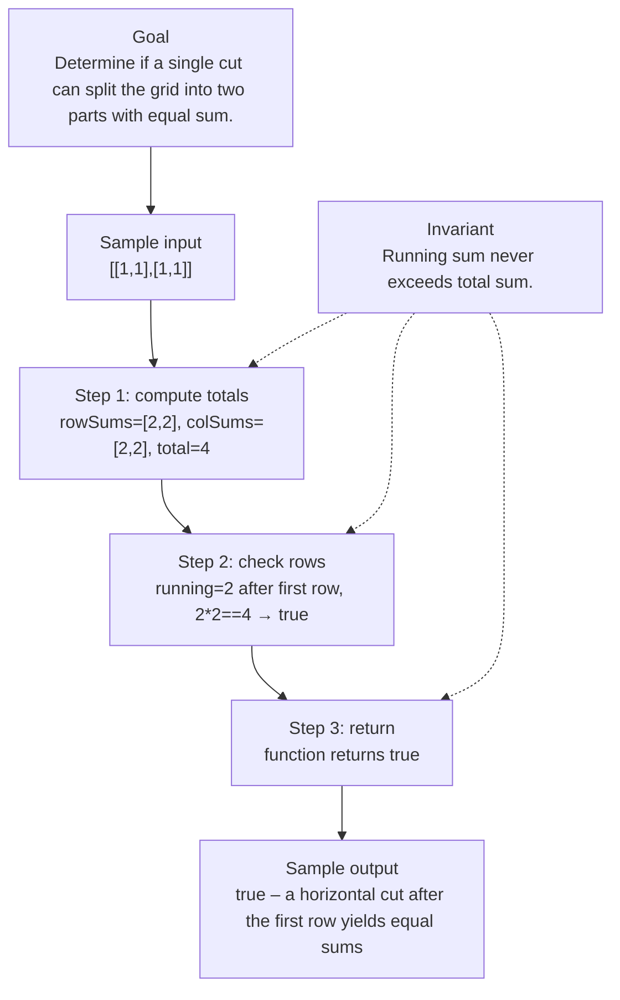

# 3546. Equal Sum Grid Partition I

[View problem on LeetCode](https://leetcode.com/problems/equal-sum-grid-partition-i/submissions/2114479201/)

- **Difficulty:** Medium
- **Language:** Java
- **Topics:** Array, Matrix, Enumeration, Prefix Sum
- **Solved:** 2026-08-20 22:24 UTC
- **Runtime:** —
- **Memory:** —

## Problem description

You are given an m x n matrix grid of positive integers. Your task is to determine if it is possible to make either one horizontal or one vertical cut on the grid such that:

## Interview overview

Compute total sum of the grid, then check if any prefix of rows or columns sums to exactly half of the total. If such a prefix exists, a single horizontal or vertical cut yields equal sums on both sides.

### Solution replay

### Approach

1. Compute the sum of each row and store in rowSums.
2. Compute the sum of each column and store in colSums.
3. Calculate the overall total sum of the grid.
4. Iterate over rowSums accumulating a running sum; if running*2 equals total, return true.
5. Iterate over colSums accumulating a running sum; if running*2 equals total, return true.
6. If no prefix matches, return false.

### Complexity

- **Time:** O(m·n) – one pass to compute row/column sums and another pass for the prefix checks.
- **Space:** O(m+n) – arrays for rowSums and colSums.

### Complexity self-check

- **Verdict:** optimal
- **Intended:** O(m·n) time and O(m+n) extra space, which matches the lower bound for scanning the whole grid.
- Any faster solution would need to avoid reading all cells, which is impossible.

### Edge cases

- A single‑row grid where a vertical cut is the only possible partition.
- A single‑column grid where a horizontal cut is the only possible partition.
- Total sum is odd – impossible to split equally.
- Cut position at the last possible line (i.e., before the final row/column).

_AI-generated with Groq; verify the analysis before relying on it._

---
_Synced by [LeetRepo](https://github.com/)_